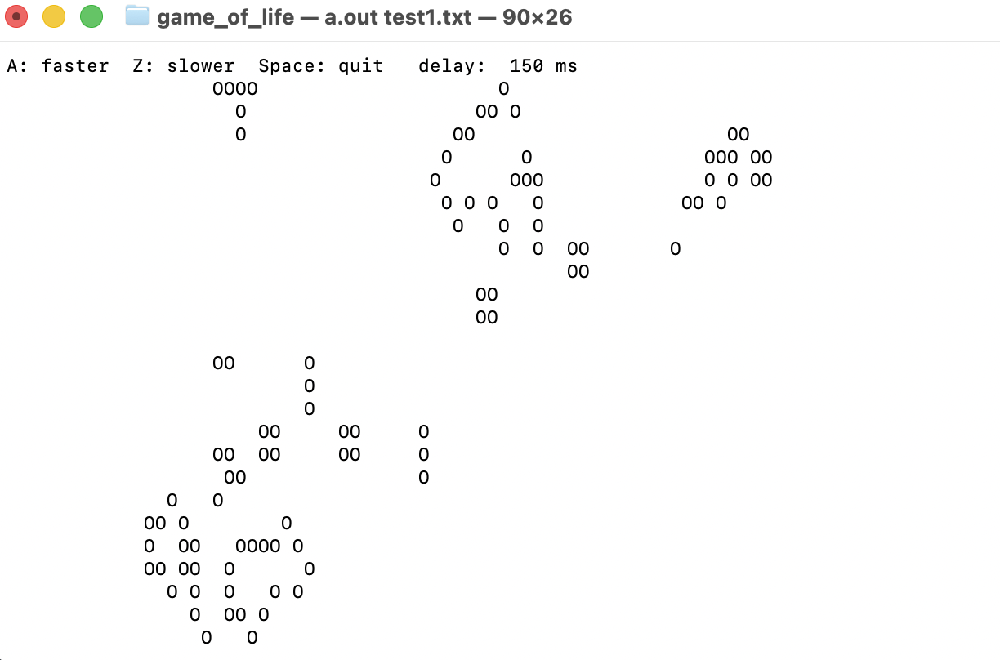
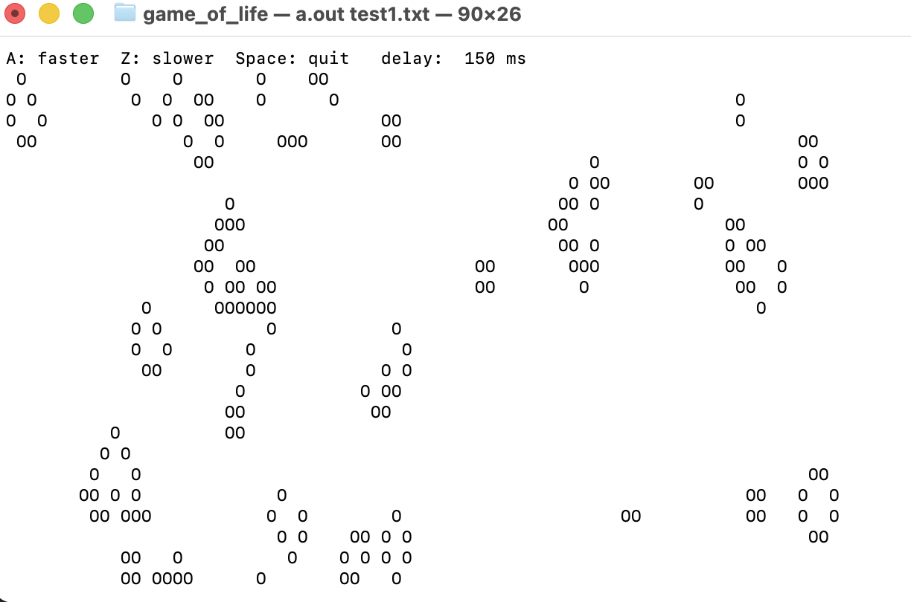

# Game of Life

Терминальная реализация клеточного автомата **Conway's Game of Life** на языке C.
Проект выполнен в рамках группового задания **School 21** командой из двух человек.
У обоих участников уже был опыт написания кода, поэтому основной акцент был сделан
не только на рабочей симуляции, но и на структуре программы, интерактивном управлении
и аккуратной работе с терминалом.

## Как это выглядит





## Идея проекта

Game of Life - это симуляция жизни клеток на двумерном поле. Каждая клетка может быть
живой или мертвой, а новое поколение рассчитывается по простым правилам:

- живая клетка выживает, если у нее 2 или 3 живых соседа;
- живая клетка умирает от одиночества или перенаселения в остальных случаях;
- мертвая клетка становится живой, если рядом с ней ровно 3 живых соседа.

Несмотря на простые правила, из них появляются устойчивые фигуры, движущиеся паттерны
и сложное поведение.

## Возможности

- поле фиксированного размера `80x25`;
- отрисовка в терминале через `ncurses`;
- интерактивное изменение скорости симуляции;
- выход из игры по клавише `Space`;
- циклические границы поля: клетки с края взаимодействуют с клетками на противоположной стороне;
- загрузка начального состояния из файла или из стандартного ввода;
- 5 готовых тестовых паттернов: `test1.txt` - `test5.txt`.

## Использованные библиотеки

- `ncurses.h` - управление терминальным экраном, отрисовка поля и неблокирующее чтение клавиш;
- `stdio.h` - чтение файлов, работа со стандартным вводом/выводом, сообщения об ошибках;
- `unistd.h` - POSIX-функции для работы с файловыми дескрипторами терминала.

Проект не использует `system()` и не требует динамического выделения памяти.

## Что интересного в реализации

### Тороидальное поле

Поле замкнуто по краям: если клетка находится на границе, ее соседи считаются с другой
стороны поля. Это реализовано через остаток от деления:

```c
int new_y = (y + delta_y + HEIGHT) % HEIGHT;
int new_x = (x + delta_x + WIDTH) % WIDTH;
```

Такой подход убирает отдельные условия для углов и краев поля.

### Двойной буфер

Для расчета следующего поколения используются два массива:

- `cur` - текущее состояние поля;
- `next` - новое состояние поля.

Это важно, потому что все клетки одного поколения должны обновляться одновременно.
Если менять `cur` сразу во время обхода, новые значения начали бы влиять на соседние
клетки в том же шаге, и правила Game of Life работали бы неправильно.

### Неблокирующее управление

`ncurses` настроен через `nodelay(stdscr, TRUE)`, поэтому программа не останавливает
симуляцию в ожидании нажатия клавиши. На каждом кадре она проверяет, была ли нажата
клавиша, применяет действие и продолжает расчет.

### Работа и с файлом, и со stdin

Программа поддерживает два способа загрузки паттерна:

```bash
./a.out test2.txt
```

и

```bash
./a.out < test2.txt
```

После чтения входных данных программа заново подключается к `/dev/tty`, чтобы `ncurses`
мог читать клавиши из терминала даже тогда, когда начальное поле было передано через
перенаправление `stdin`.

## Требования

- C-компилятор, например `gcc`;
- библиотека `ncurses`;
- терминал размером не меньше `80x26` символов.

На macOS `ncurses` обычно уже доступен. На Linux при необходимости его можно установить
через пакетный менеджер, например `libncurses-dev` или `ncurses-devel`.

## Сборка

В корне проекта выполните:

```bash
gcc game_of_life.c -lncurses
```

После сборки появится исполняемый файл `a.out`.

Для более строгой проверки можно собрать с предупреждениями:

```bash
gcc -Wall -Wextra -Werror game_of_life.c -lncurses
```

## Запуск

Запуск с готовым паттерном:

```bash
./a.out test1.txt
```

Другие варианты:

```bash
./a.out test2.txt
./a.out test3.txt
./a.out test4.txt
./a.out test5.txt
```

Можно также передать поле через стандартный ввод:

```bash
./a.out < test1.txt
```

## Управление

- `A` - ускорить симуляцию;
- `Z` - замедлить симуляцию;
- `Space` - выйти из программы.

Текущая задержка между поколениями отображается в верхней строке терминала.

## Формат входного файла

Файл начального состояния состоит из 25 строк. Каждая строка описывает одну строку поля.

- `O` - живая клетка;
- любой другой символ, например `.`, считается пустой клеткой.

Пример небольшого фрагмента:

```text
................................................................................
.O..............................................................................
..OO............................................................................
.OO.............................................................................
................................................................................
```

Поле в проекте рассчитано на 80 символов в строке и 25 строк. Если строка короче,
оставшиеся клетки считаются пустыми.

## Как должна работать программа

После запуска программа считывает начальное поле, открывает полноэкранный режим
терминала и начинает обновлять поколения. Живые клетки отображаются символом `O`,
пустые клетки - пробелом. На каждом шаге программа:

1. очищает экран;
2. рисует строку статуса и поле;
3. проверяет нажатые клавиши;
4. рассчитывает следующее поколение;
5. делает паузу с текущей задержкой.

Если программа сразу завершается, проверьте размер окна терминала: нужен экран
минимум `80x26`, потому что 25 строк занимает поле и еще 1 строка нужна для статуса.

## Структура проекта

```text
.
├── game_of_life.c
├── README.md
├── test1.txt
├── test2.txt
├── test3.txt
├── test4.txt
├── test5.txt
└── img/
    ├── game-of-life-start.png
    └── game-of-life-running.png
```

## Команда

Проект выполнен командой из двух человек в рамках School 21.

Роли в команде:

- Team Lead;
- Developer.

Оба участника имели опыт программирования, поэтому работа была распределена вокруг
проектирования логики, реализации терминального интерфейса, подготовки паттернов и
проверки корректности поведения симуляции.
